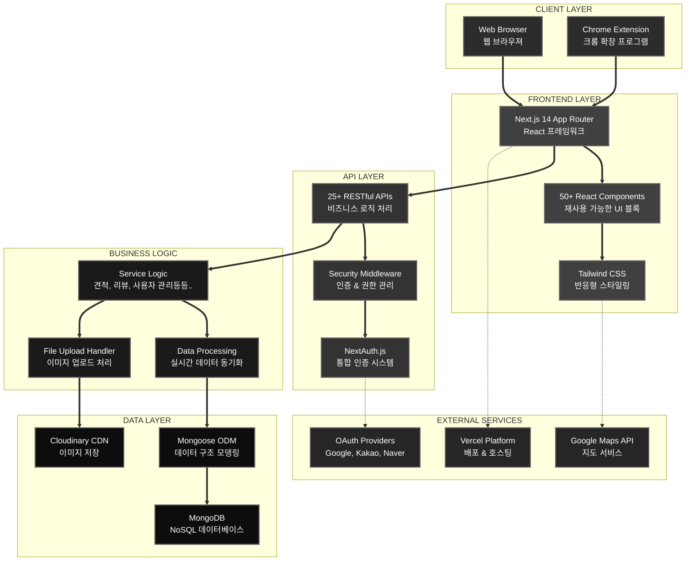

# 🖥️ 웰컴시스템(WellComSystem) - 컴퓨터 전문점 통합 관리 시스템

> **35년 전통의 컴퓨터 전문점을 위한 Full-Stack 웹 애플리케이션**  
> 견적 관리, 리뷰 관리, 고객 관리, 서비스 관리를 하나로 통합한 디지털 비즈니스 솔루션

[](https://nextjs.org/)
[](https://reactjs.org/)
[](https://mongodb.com/)
[](https://tailwindcss.com/)

## 📋 프로젝트 개요

**웰컴시스템**는 35년 전통의 컴퓨터 전문점 "웰컴시스템"의 비즈니스 프로세스를 완전히 디지털화한 통합 관리 시스템입니다. 기존 오프라인 중심의 운영 방식을 현대적인 웹 기반 시스템으로 고객 경험 향상과 업무 효율성 극대화 하였습니다.

**🎯 프로젝트 목표:**

- 관리자가 사용할 견적작성/견적서인쇄/서비스관리/리뷰관리/데이터저장/회원계정관리 기능 제작
- 고객이 서비스신청/리뷰작성 기능 제작
- 메인페이지에 영상/이미지/리뷰를 통한 마케팅 강화
- SEO 최적화를 통해 구글 검색 상단에 노출

## 👨‍💻 제작정보

| 항목          | 내용                               |
| ------------- | ---------------------------------- |
| **제작인원**  | 김창준 (Full-Stack Developer)      |
| **제작기간**  | 2025.03.23 ~ 2025.06.15 (약 3개월) |
| **개발 방식** | 개인 프로젝트 (End-to-End 개발)    |

### 🔧 개발과정

- **기획 & 분석**: 비즈니스 요구사항 분석 및 시스템 설계
- **Frontend 개발**: React/Next.js 기반 사용자 인터페이스 구현
- **Backend 개발**: RESTful API 설계 및 데이터베이스 모델링
- **DevOps**: Vercel 배포 자동화 및 성능 최적화
- **SEO 최적화**: 검색 엔진 최적화 및 구조화된 데이터 구현

### 📊 개발 통계

| 지표               | 수치           |
| ------------------ | -------------- |
| **커밋 수**        | 200+ commits   |
| **코드 라인**      | 15,000+ lines  |
| **API 엔드포인트** | 25+ endpoints  |
| **React 컴포넌트** | 50+ components |

## 🚀 주요 기능

### 🔐 **인증 & 권한 관리**

- NextAuth.js 기반 소셜 로그인 (Google, Kakao, Naver)
- JWT 토큰 기반 세션 관리
- 역할 기반 접근 제어 (고객/관리자)

### 💼 **사용자 기능**

- **서비스 신청 시스템**: 컴퓨터/프린트/노트북/AS/기타문의 서비스 신청 시스템
- **리뷰 시스템**: 리뷰 작성 및 이미지 업로드 시스템
- **신청한 서비스 진행확인**: 신청했던 서비스 진행도 확인기능

### 📊 **관리자 기능**

- **견적 작성**: 컴퓨터/프린트/노트북 견적을 쉽게 작성
- **견적서 인쇄**: 작성한 견적을 특정한 형식에 맞게 인쇄 기능
- **서비스 관리**: 사용자가 온라인으로 신청한 서비스 관리
- **자료/기록 데이터 관리**: 저장 해둘 필요가 있는 데이터를 관리 기능
- **사용자 관리**: 회원가입한 계정을 관리

### 🔧 **Chrome Extension(크롬 확장 프로그램)**

- 다나와에서 선택한 부품 정보 원클릭으로 웰컴 사이트로 가져오기기
- 견적 작성할 때 다나와에서 복사한 데이터 일괄 입력 가능

### Ⓜ️ **메인 페이지**

- 영상/이미지 쇼케이스 섹션
- 사용자들이 작성한 리뷰 섹션

### 🌐 **SEO & 성능 최적화**

- 구조화된 데이터 (Schema.org) 완전 구현
- Core Web Vitals 최적화
- 이미지 최적화 및 지연 로딩
- 캐싱 전략 구현

## 🛠️ 기술 스택

### **프론트엔드**

- **프레임워크**: Next.js 14.1.0 (App Router)
- **UI 라이브러리**: React 18.3.0
- **스타일링**: Tailwind CSS 3.3.0
- **애니메이션**: Framer Motion 12.6.0
- **아이콘**: Lucide React, React Icons

### **백엔드**

- **서버 환경**: Node.js
- **데이터베이스**: MongoDB 6.16.0 with Mongoose 8.12.2
- **인증**: NextAuth.js 4.24.11
- **파일 업로드**: Cloudinary
- **API**: RESTful API with Next.js API Routes

### **배포 및 도구**

- **배포**: Vercel
- **이미지 CDN**: Cloudinary
- **분석**: Vercel Analytics & Speed Insights
- **코드 품질**: Prettier, ESLint
- **버전 관리**: Git, GitHub

## 🏗️ 시스템 아키텍처

### **전체 아키텍처 다이어그램**



### **🔧 아키텍처 구성 요소**

#### **🌐 1. 클라이언트 레이어 (Client Layer)**

> **사용자 접점 인터페이스 계층**

- **🖥️ 웹 브라우저**:
  - 반응형 웹 인터페이스 제공
  - 모든 디바이스(Desktop, Tablet, Mobile) 지원
- **🔧 크롬 확장 프로그램**:
  - 다나와 쇼핑몰 연동 전용 도구
  - 원클릭 상품 정보 추출 및 전송
  - 견적 작성 업무 효율성 극대화

#### **🎨 2. 프론트엔드 레이어 (Frontend Layer)**

> **사용자 경험 및 인터페이스 구현 계층**

- **⚡ Next.js 14 App Router**:

  - Server-Side Rendering(SSR) 및 Client-Side Rendering(CSR)
  - 파일 기반 라우팅 시스템

- **🧩 50+ React 컴포넌트**:

  - 재사용 가능한 모듈화된 UI 블록
  - 상태 관리 및 이벤트 핸들링

- **💄 Tailwind CSS**:
  - 유틸리티 퍼스트 스타일링 방식
  - 반응형 디자인

#### **🔌 3. API 레이어 (API Layer)**

> **클라이언트-서버 통신 및 요청 처리 계층**

- **📡 25+ RESTful APIs**:

  - 견적 관리, 리뷰 시스템, 사용자 관리 등 핵심 기능
  - JSON 기반 데이터 교환
  - HTTP 메서드별 적절한 응답 코드 반환

- **🛡️ Security Middleware**:

  - 요청 검증 및 인증 상태 확인
  - Rate Limiting으로 API 남용 방지
  - 유지보수 모드 제어 기능

- **🔐 NextAuth.js**:
  - 다중 OAuth 제공자 통합 관리
  - JWT 토큰 기반 세션 관리
  - CSRF 및 보안 취약점 방지

#### **⚙️ 4. 비즈니스 로직 레이어**

> **핵심 업무 규칙 및 데이터 처리 계층**

- **📊 Service Logic**:

  - **서비스 신청**: A/S, 프린터 대여 신청 처리 워크플로우
  - **견적 시스템**: 복합 하드웨어 견적 계산 알고리즘
  - **리뷰 관리**: 평점 계산 및 승인 워크플로우
  - **관리자 시스템**: 신청 승인/거부, 상태 변경 등...

- **🔄 Data Processing**:

  - 실시간 데이터 동기화 및 검증
  - 비즈니스 규칙 적용 및 데이터 변환
  - 에러 핸들링 및 롤백 처리

- **📁 File Upload Handler**:
  - 다중 이미지 업로드
  - 파일 크기 제한 및 형식 검증
  - 이미지 압축 및 최적화 처리

#### **💾 5. 데이터 레이어 (Data Layer)**

> **데이터 저장 및 관리 계층**

- **🍃 MongoDB**:

  - NoSQL 문서 지향 데이터베이스
  - 유연한 스키마 구조로 확장성 확보
  - 인덱싱 및 쿼리 최적화 구현

- **🔗 Mongoose ODM**:

  - 객체 문서 매핑 및 스키마 검증
  - 관계형 데이터 구조 모델링
  - 데이터베이스 연결 풀링 관리

- **☁️ Cloudinary CDN**:
  - 이미지 저장 및 전역 배포

#### **🌍 6. 외부 서비스 레이어 (External Services)**

> **서드파티 서비스 통합 계층**

- **🔑 OAuth Providers**:

  - **Google**: Gmail 계정 연동 로그인
  - **Kakao**: 카카오톡 소셜 로그인
  - **Naver**: 네이버 아이디 연동

- **🚀 Vercel Platform**:

  - Edge Computing 기반 전역 배포
  - 자동 CI/CD 파이프라인
  - 실시간 성능 모니터링

- **🗺️ Google Maps API**:
  - 매장 위치 정보 표시
  - 길찾기 및 주변 정보 제공
  - 반응형 지도 인터페이스

## 📁 디렉터리 / 웹 페이지 구조

### **📂 핵심 디렉터리 구조**

```
wellcomplus/
├── app/                          # Next.js 14 App Router
│   ├── api/                      # RESTful API 엔드포인트
│   │   ├── auth/                 # 소셜 로그인 (Google, Kakao, Naver)
│   │   ├── reviews/              # 리뷰 CRUD + 이미지 업로드
│   │   ├── applications/         # 견적 신청 시스템
│   │   └── manage/               # 관리자 전용 API
│   ├── components/               # 재사용 컴포넌트
│   ├── userpage/                 # 사용자 마이페이지, 신청페이지
│   └── manage/                   # 관리자 대시보드
├── models/                       # MongoDB 스키마 정의
│   ├── User.js                   # 사용자 모델
│   ├── Application.js            # 견적 신청 모델
│   └── Review.js                 # 리뷰 모델
├── lib/                          # 핵심 라이브러리
│   ├── mongodb.js                # DB 연결 관리
│   └── cloudinary.js             # 이미지 CDN 연동
├── utils/                        # 유틸리티 함수
└── chrome-extension-real/        # 다나와 연동 확장프로그램
```

### 📋 웹 페이지 구조 / 사이트맵

**📊 인터랙티브 사이트맵**: [웹 페이지 구조 보기](https://octopus.do/rvrrdzz8t5h)

## 🖼️ 실제 구현 화면

### **🏠 메인 페이지**


**주요 특징:**

- **Hero Section**: 35년 전통 강조와 맞춤형 솔루션 어필
- **조립 컴퓨터 갤러리**: 실제 제작 영상,이미지 쇼케이스
- **서비스 특징 카드**: 4개 핵심 가치 제안 (맞춤형 설계, 지속적 AS, 35년 노하우, 당일 출고)
- **고객 리뷰 섹션**: 실제 고객 후기와 평점 표시
- **찾아오시는 길**: Google Maps 연동 및 상세 회사 정보

---

### **🔐 인증 시스템**

#### **로그인 페이지**


**다중 인증 시스템:**

**🔐 일반 로그인 (Credentials)**

- **아이디/비밀번호**: 전통적인 로그인 방식
- **비밀번호 해싱**: bcrypt를 사용한 안전한 비밀번호 저장
- **입력 검증**: 실시간 유효성 검사 및 오류 메시지 표시

**🌐 소셜 로그인 (OAuth)**

- **Google 로그인**: 간편한 구글 계정 연동
- **Kakao 로그인**: 카카오톡 계정 연동
- **Naver 로그인**: 네이버 계정 연동

**🛡️ 보안 및 인증 구현**

- **NextAuth.js**: 통합 인증 라이브러리 활용
- **JWT 토큰**: 안전한 세션 관리
- **CSRF 보호**: Cross-Site Request Forgery 방지

#### **회원가입 페이지**


**다중 회원가입 방식:**

**📝 일반 회원가입 (이메일/비밀번호)**

- **필수 정보**: 이름(닉네임), 이메일(ID), 전화번호, 비밀번호
- **중복 확인**: 이름, 이메일, 전화번호 실시간 중복 검사
- **전화번호 포맷팅**: 자동 하이픈(-) 추가 및 유효성 검증
- **실시간 유효성 검증**: 입력 즉시 오류 표시

**🔒 비밀번호 보안 규칙**

- **최소 길이**: 10자 이상 필수
- **복합 조건**: 알파벳, 숫자, 특수문자 각각 1개 이상 포함
- **실시간 피드백**: 각 조건별 충족 여부 시각적 표시 (✓/✗)
- **안전한 저장**: bcrypt 해싱(12 라운드)으로 암호화

**🌐 소셜 회원가입 (간편 가입)**

- **Google 계정**: 원클릭 Google OAuth 연동
- **카카오 계정**: 카카오톡 계정으로 간편 가입
- **네이버 계정**: 네이버 아이디로 즉시 가입
- **자동 정보 연동**: 소셜 계정 프로필 정보 자동 매핑

---

### **💻 서비스 신청 페이지**

#### **컴퓨터 견적 신청(다른 서비스 신청 비슷)**


**핵심 기능:**

- **사용목적 상세 입력**: 게임/업무/영상편집 등 용도별 맞춤 견적
- **예산 입력 시스템**: 실시간 예산 포맷팅 및 유효성 검증
- **하드웨어 선택**: CPU, GPU, 메모리, 저장장치 등 선택적 입력
- **파일 첨부**: 참고자료 업로드 (Cloudinary 연동)
- **실시간 진행률**: 업로드 진행상황 시각적 표시

---

### **👤 사용자 페이지 (마이페이지)**

#### **서비스 신청 현황**


**진행상황 추적:**

- **상태별 분류**: 접수/진행중/완료/취소
- **상세 정보 확인**: 신청 내용 및 견적 결과
- **실시간 진행상황 열람**: 상태 변경 시 즉시 업데이트
- **히스토리 관리**: 과거 신청 이력 조회

#### **리뷰 작성 시스템**


**풍부한 리뷰 기능:**

- **별점 평가**: 1-5점 시각적 평점 시스템
- **이미지 업로드**: 다중 이미지 첨부 (최대 5장)
- **리뷰 수정/삭제**: 작성한 리뷰 수정/삭제 가능

---

### **⚙️ 관리자 페이지**

#### **견적 작성**


**전문적인 견적 도구:**

- **부품별 세부 입력**: CPU, GPU, RAM 등 상세 사양작성 가능
- **크롬 확장프로그램**: 상품정보를 다나와에서 쉽게 가져오기 가능
- **실시간 가격 계산**: 부품 선택 시 자동 합계 산출

#### **Chrome Extension(다나와 연동 도구)**


**혁신적인 연동 서비스:**

- **원클릭 데이터 전송**: 다나와 → 웰컴시스템 데이터 복사/입력 가능
- **부품 정보 자동 입력**: 분류, 제품명, 가격 자동 매핑
- **사용자 친화적 UI**: 간단한 버튼 클릭으로 작동

#### **견적서 인쇄 시스템**


**전문적인 견적서 출력 기능:**

- **깔끔한 디자인**: 깔끔하고 전문적인 견적서 레이아웃
- **맞춤형 템플릿**: 업체 브랜딩이 적용된 견적서 양식
- **원클릭 출력**: 간편한 인쇄 버튼으로 즉시 출력 가능

#### **서비스 관리**


**통합 서비스 관리 시스템:**

이 페이지는 **신청, 진행, 완료, 취소**로 구분되어 있으며, 신청된 서비스들을 확인하고 진행상태를 변경하여 사용자에게 진행 과정을 실시간으로 보여줄 수 있도록 관리하는 페이지입니다.

- **상태별 분류 관리**: 신청됨 → 진행중 → 완료, 취소 단계별 상태 관리
- **고객 서비스 추적**: 각 고객의 서비스 진행 과정을 투명하게 관리
- **실시간 현황 파악**: 전체 서비스 현황을 한눈에 확인 가능

#### **리뷰 관리 시스템**


**컨텐츠 관리:**

- **리뷰 승인/거부**: 부적절한 리뷰 필터링
- **메인 노출 설정**: 우수 리뷰 메인페이지 노출

#### **사용자 관리**


- **회원 정보 조회**: 가입된 모든 회원의 기본 정보 및 활동 현황
- **리뷰 활동 추적**: 각 회원이 작성한 리뷰 목록 및 평점 확인
- **서비스 신청 이력**: 회원별 견적 신청 및 문의 내역 통합 조회

---

### **📱 반응형 디자인**

#### **모바일 최적화**


**모든 디바이스 지원:**

- **Touch-friendly**: 터치 인터페이스 최적화
- **적응형 레이아웃**: 화면 크기별 최적 배치
- **빠른 로딩**: 이미지 지연 로딩 및 압축 최적화

---

## 🌐 배포 & 사이트 주소

**🔗 Live Site**: [https://www.okwellcom.com](https://www.okwellcom.com)

| 환경             | URL                                                    | 설명                  |
| ---------------- | ------------------------------------------------------ | --------------------- |
| **Production**   | [https://www.okwellcom.com](https://www.okwellcom.com) | 실제 서비스           |
| **데이터베이스** | MongoDB Atlas                                          | 클라우드 데이터베이스 |
| **CDN**          | Cloudinary                                             | 이미지 저장소         |

**배포 내용:**

- **Platform**: Vercel (자동 CI/CD)
- **Domain**: 커스텀 도메인 연결 (가비아)
- **TSL**: HTTPS 보안 적용

**성능 지표:**

- **Lighthouse 점수**: 95+ (성능, SEO, 접근성)
- **Core Web Vitals**: 모든 지표 Good 달성
- **Page Load Time**: < 2초

## 💡 프로젝트를 통해 배운 점

### **🎯 기술적 성장**

**1. Full-Stack 개발 역량 강화**

- Next.js App Router의 깊이 있는 이해와 활용
- MongoDB와 Mongoose를 활용한 NoSQL 데이터베이스 설계
- RESTful API 설계 원칙과 확장 가능한 아키텍처 구현
- 실시간 데이터 동기화와 상태 관리 최적화

**2. 성능 최적화 강화**

- Core Web Vitals 지표 개선을 통한 사용자 경험 향상
- 이미지 최적화, 지연 로딩, 캐싱 전략 구현
- Lighthouse 점수 90+점 달성을 통한 웹 성능 최적화
- CDN 활용과 HTTP 헤더 최적화를 통한 로딩 속도 개선

### **🔧 문제 해결 능력**

**1. 복잡한 비즈니스 로직 구현**

- 견적 시스템의 복잡한 계산 로직 최적화
- 다중 이미지 업로드와 실시간 진행상황 표시
- 사용자 권한별 차등 기능 제공 시스템
- 크롬 확장 프로그램과 웹 애플리케이션 연동

**2. 확장성 고려한 아키텍처**

- 모듈화된 컴포넌트 설계로 재사용성 극대화
- API 버전 관리와 하위 호환성 유지
- 데이터베이스 스키마 설계 시 미래 확장성 고려

### **🚀 개발 프로세스 개선**

**효율적인 개발 워크플로우**

- Git Flow 전략 수립과 브랜치 관리
- Prettier, ESLint를 활용한 코드 품질 관리
- 자동화된 배포 파이프라인 구축
- 성능 모니터링 시스템 구축

### **🤖 AI 도구 활용과 학습 전략**

**현대적 개발 환경에서의 AI 활용 경험**

이 프로젝트 개발 과정에서 **AI 기반 개발 도구들을 적극 활용**하여 생산성과 코드 품질을 크게 향상시킬 수 있었습니다.

**✅ AI 활용의 장점:**

- **생산성 극대화**: 반복적인 코드 작성 시간을 70% 단축
- **코드 품질 향상**: AI가 제안하는 최적화 기법과 고급 개발 방법론 학습
- **빠른 문제 해결**: 복잡한 에러나 버그 상황에서 즉시 해결 방안 탐색
- **새로운 기술 학습**: 생소한 라이브러리나 API 사용법을 빠르게 습득

**⚠️ AI 활용의 문제와 대응 전략:**

- **코드 이해도 부족**: AI가 생성한 코드의 동작 원리를 **반드시 재학습하고 내재화**
- **의존성 위험**: AI 제안을 맹신하지 않고 **직접 검증하고 테스트하는 습관** 유지
- **창의성 제한**: AI 솔루션에만 의존하지 않고 **독창적인 접근 방식도 시도**

**🎯 AI와 함께하는 효과적인 학습 방법:**

1. **AI 코드 분석**: 생성된 코드를 한 줄씩 분해하여 동작 원리 파악
2. **수정과 개선**: AI 제안을 기반으로 프로젝트에 맞게 커스터마이징
3. **문서화 습관**: AI로 작성한 부분도 주석과 문서로 명확히 기록
4. **지속적 검증**: 코드 리뷰와 테스트를 통한 품질 검증 프로세스 구축

**💡 개발자로서의 AI 활용 느낀점:**

> **"핵심은 문제 해결 능력과 기술에 대한 깊은 이해하는 것이 AI를 효과적으로 활용하는 능력이 된다."**

AI가 빠르게 발전하는 현 시점에서, 단순히 AI를 '사용'하는 것보다는 **AI를 활용해 더 깊이 학습하고 성장하는 것**이 진정한 경쟁력이라고 생각합니다.

이 프로젝트를 통해 AI와 협업하면서도 **본질적인 개발 역량과 문제 해결 능력을 키우는 균형잡힌 접근법**을 체득할 수 있었습니다.

---

## 📞 Contact

**프로젝트 관련 문의나 기술적 논의를 환영합니다!**

- **Email**: [kcj980@naver.com]

---
